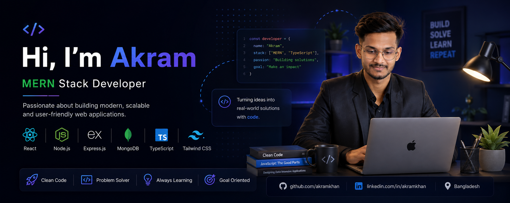

<div align="center">



</div>

<div align="center">


# 👋 Hi, I'm Akram Mohammad Khan

### 💻 MERN Stack Developer

**Building modern web experiences • Learning by building • Growing every day**

<a href="https://github.com/AkramMdkhan">
  
</a>
<a href="https://github.com/AkramMdkhan?tab=repositories">
  
</a>

</div>

---

## 👨‍💻 About Me

I'm **Akram Mohammad Khan**, a developer currently focused on learning and building with the **MERN stack**.

I enjoy turning ideas into responsive, clean and user-friendly web applications. My current focus is strengthening my JavaScript fundamentals, learning React and TypeScript, and gradually building full-stack applications.

```javascript
const akram = {
  name: "Akram Mohammad Khan",
  role: "MERN Stack Developer",
  focus: "Full-Stack Web Development",
  currentlyLearning: ["React", "TypeScript", "Node.js", "MongoDB"],
  mindset: "Build • Solve • Learn • Repeat"
};
```

---

## 🛠️ Tech Stack

### Frontend

<p>
  
</p>

### Backend & Database

<p>
  
</p>

### Languages & Tools

<p>
  
</p>

---

## 🚀 Featured Projects

### 🌐 Portfolio Website

A simple responsive portfolio website built while practicing frontend development.

**Tech:** HTML • CSS

🔗 [View Repository](https://github.com/AkramMdkhan/B-14-Portfolio-Website-Mary-Hardy-)

---

### 🎤 Dev Conf Website

A responsive conference-style website created as a frontend assignment.

**Tech:** HTML • CSS

🔗 [View Repository](https://github.com/AkramMdkhan/Dev-Conf-PH-hero-Assignment-1)

---

## 📊 GitHub Stats

<div align="center">


</div>

---

## 🔥 Contribution Streak

<div align="center">


</div>

---

## 📈 GitHub Activity

<div align="center">


</div>

---

## 📚 Currently Learning

<p align="center">
  
</p>

- ⚛️ React & component-based development
- 🟦 TypeScript fundamentals
- 🟢 Node.js & Express
- 🍃 MongoDB
- 🔗 Building full-stack MERN applications
- 🧩 Improving JavaScript problem-solving skills

---

## 🎯 My Goals

- [x] Build responsive HTML & CSS websites
- [x] Practice JavaScript fundamentals
- [x] Learn ES6+ concepts
- [x] Start TypeScript
- [ ] Build advanced React applications
- [ ] Build complete MERN applications
- [ ] Deploy production-ready projects
- [ ] Become a professional Full-Stack Developer

---

## 💡 Developer Mindset

> **Build. Solve. Learn. Repeat. 🚀**

I believe the best way to improve as a developer is to keep building, make mistakes, understand them, and build again.

---

## 🤝 Let's Connect

<div align="center">

<a href="https://github.com/AkramMdkhan">

</a>

<!-- Add your LinkedIn when ready -->
<!--
<a href="https://www.linkedin.com/in/YOUR_USERNAME">

</a>
-->

</div>

---

<div align="center">

### ⭐ Thanks for visiting my profile!

**Always learning. Always building. 🚀**


</div>
